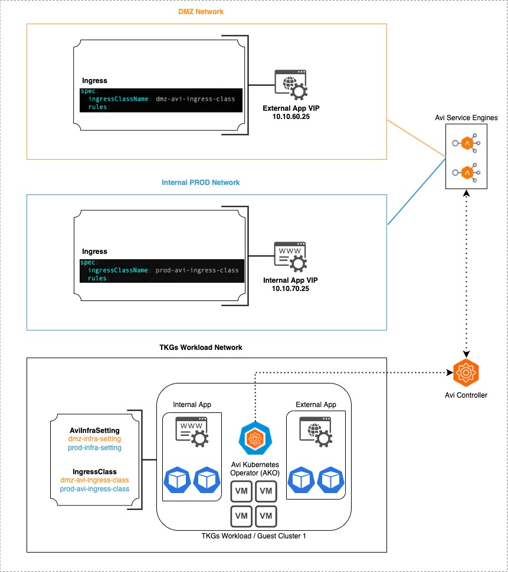
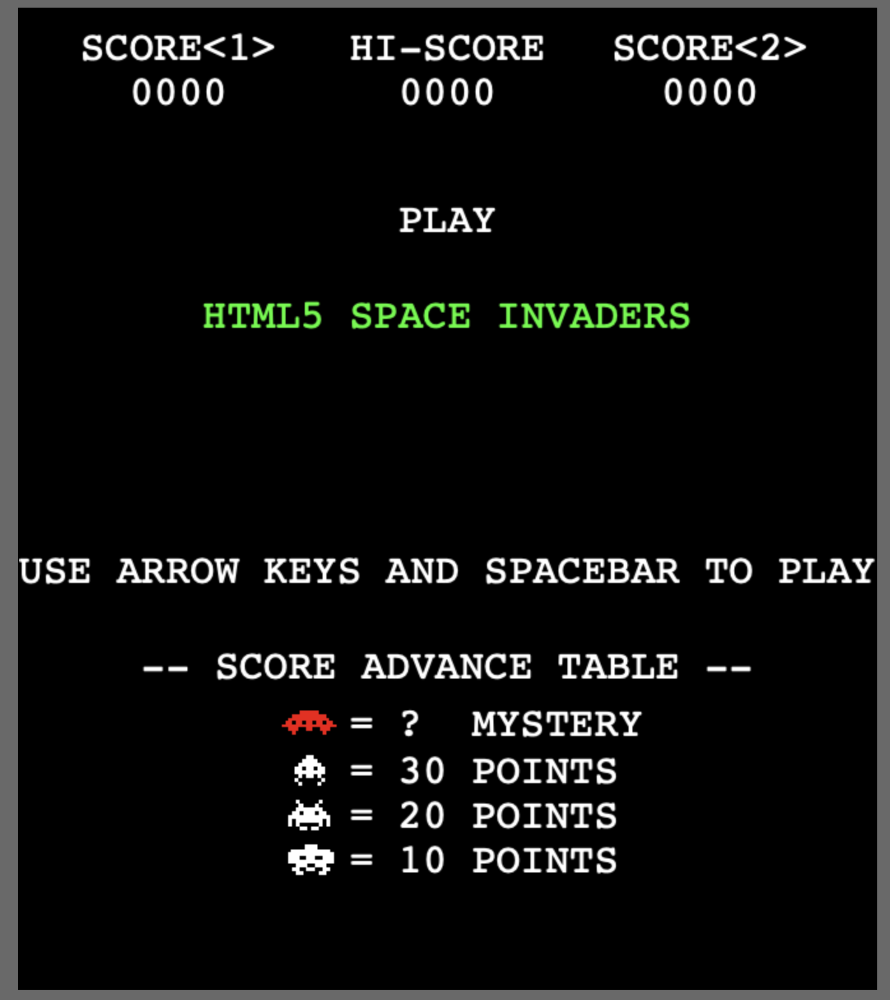

# Deploy Ingress in Multiple Networks by using Multiple Ingress Classes

## What do we want to achieve?
- We have 1 TKGs Workload / Guest Cluster
- This Guest Cluster runs 1 Application (Space Invaders)
- We want to expose this Application in 2 Different Networks (External DMZ Network & Internal Prod Network) leveraging Avi
- The Networks are: DMZ (10.10.60.0/24) and Internal Production(10.10.70.0/24)

This example can also be used to expose different applications in separate networks as shown below:



## Remarks
For the sake of this Demo I have added everything in separate YAML files so it's easier to track in the steps explained below.
These 'Step by Step' YAML files can be found in this Repo under [yaml/Step by Step](/yaml/step-by-step). 

However everything can definitely be combined in 1 YAML file using '---' as separator. If you would like to use this 'All in One' file, 
be sure to check it out under [yaml/All in One](yaml/all-in-one). 

## What do we need? 
1. A working TKGs Workload / Guest Cluster
2. vSphere configured with 2 Networks for DMZ & Prod respectively
3. Avi configured with 2 Networks containing IP Ranges for VIP Assignment
4. Avi Configured with a DNS Profile
5. Avi Configured with an IPAM Porfile
6. Avi Configured with a Cloud (e.g.: Default-Cloud)
7. Avi Configured with a Sevice Engine Group (e.g.: Default-Group)
8. Ako installed & configured in your TKGs Workload / Guest Cluster (see [this article for install instructions](https://vra4u.com/2022/02/07/tkgs-use-nsx-alb-avi-as-ingress-controller-for-vsphere-with-tanzu/))

## Let's get Started!
1. Start with creating **2 AviInfraSettings** Objects in your Workload / Guest Cluster
```
vi 1-avi-settings-dmz.yaml
vi 1-avi-settings-prod.yaml
```
Make sure to **modify at least the following section(s)** in each file:

**DMZ AviInfraSettings**
```
spec:
  seGroup:
    name: Default-Group #Make sure this matches your Service Engine Group that you've configured in Avi!
  network:
    vipNetworks:
      - networkName: "DMZ Network" #Add your Network Name here
        cidr: 10.10.60.0/24#Add your CIDR here
```
**PROD AviInfraSettings**
```
spec:
  seGroup:
    name: Default-Group #Make sure this matches your Service Engine Group that you've configured in Avi!
  network:
    vipNetworks:
      - networkName: "PROD Network" #Add your Network Name here
        cidr: 10.10.70.0/24#Add your CIDR here
```
These AviInfraSettings objects will refer to each Network respectively (DMZ & Prod).
```
kubectl apply -f 1-avi-settings-dmz.yaml
kubectl apply -f 1-avi-settings-prod.yaml
```

2. Now let's **create 2 IngressClasses** which refer to the AviInfraSettings we just created
```
vi 2-dmz-ingressclass.yaml
vi 2-prod-ingressclass.yaml
```
Make sure that the following **section refers to your AviInfraSettings** Objects you just created:

**DMZ IngressClass**
```
parameters:
    apiGroup: ako.vmware.com
    kind: AviInfraSetting
    name: dmz-infra-setting #Refer to your AviInfraSetting Object here
```
**PROD IngressClass**
```
parameters:
    apiGroup: ako.vmware.com
    kind: AviInfraSetting
    name: prod-infra-setting #Refer to your AviInfraSetting Object here
```
Great! So we have now 2 IngressClasses Objects referring to each Network!
```
kubectl apply -f 2-dmz-ingressclass.yaml
kubectl apply -f 2-prod-ingressclass.yaml
```

3. Let's **deploy** our **Application** (Space Invaders)!
```
kubectl apply -f 3-spaceinvaders-deployment.yaml
```
It might take a minute or 2 for the Pods to be up and running.
You can monitor it with the following command:
```
kubectl get pods -w
```

4. Let's create a **Cluster IP Service** for our Space Invaders application!
```
kubectl apply -f 4-spaceinvaders-clusterip.yaml
```
Make sure that your Service is up and running
```
kubectl get services
```
5. Now let's create **2 Ingress Objects** which reference our IngressClasses that we defined earlier. 
```
vi 5-spaceinvaders-ingress-dmz.yaml
vi 5-spaceinvaders-ingress-prod.yaml
```
Make sure to **modify** at least the following section to your needs:
**DMZ Ingress**
```
spec:
  ingressClassName: dmz-avi-ingress-class 
  rules:
  - host: hostname-dmz.avi.example.local #Make sure to modify your hostname here
```
**PROD Ingress**
```
spec:
  ingressClassName: prod-avi-ingress-class 
  rules:
  - host: hostname-prod.avi.example.local #Make sure to modify your hostname here
```
Let's **deploy** it!
```
kubectl apply -f 5-spaceinvaders-ingress-dmz.yaml
kubectl apply -f 5-spaceinvaders-ingress-prod.yaml
```

## Result
Now you should have our Space Invaders application presented on 2 different Networks! 
You can use your favourite browser and browse to the websites! Make sure that the DNS Hostnames resolve. 
