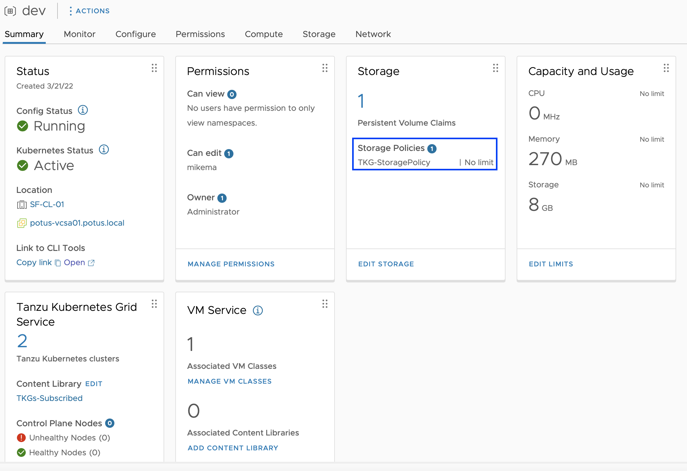
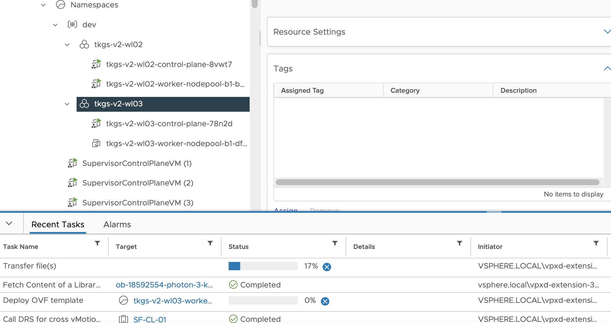

# How to Create a Tanzu Kubernetes Cluster

Creating a Tanzu Kubernetes Cluster for Workload Provisioning is shortly described below. 

The Official VMware Documentation can be found here:

https://docs.vmware.com/en/VMware-vSphere/7.0/vmware-vsphere-with-tanzu/GUID-2597788E-2FA4-420E-B9BA-9423F8F7FD9F.html


## Table of Contents
1. [Prerequisites](#prerequisites)
1. [Check Virtual Machine Classes in your vSphere Namespace](#check-virtual-machine-classes-in-your-vsphere-namespace)
1. [Check Storage Classes in your vSphere Namespace](#check-storage-classes-in-your-vsphere-namespace)
1. [Create a Tanzu Kubernetes Cluster Specification](#create-a-tanzu-kubernetes-cluster-specification)
1. [Create a Tanzu Kubernetes Cluster using that Specification](#create-a-tanzu-kubernetes-cluster-using-that-specification)

## Prerequisites
* [Make sure you are logged in](How-to-Login.md) and connected to the vSphere Namespace where you would like to deploy a Tanzu Kubernetes Cluster. 

## Check Virtual Machine Classes in your vSphere Namespace

To size your Tanzu Kubernetes Clusters, you can specify the Virtual Machine Classes to use. A vSphere Administrator can assign certain Virtual Machine Classes for you to use in a specific vSphere Namespace. 

As a developer you can find out which Sizes (Virtual Machine Classes) are available for your Tanzu Kubernetes Clusters by running the following command:

````
kubectl get virtualmachineclasses

NAME                 CPU   MEMORY   AGE
best-effort-xsmall   2     2Gi      9d
````

In the vSphere Namespace that I'm connected to, the vSphere Administrator has assigned only 1 Size (Virtual Machine Class) for me to use. 

To view details of the Virtual Machine CLasses, you can run the following command:

````
kubectl describe virtualmachineclasses

Name:         best-effort-xsmall
Namespace:    
Labels:       <none>
Annotations:  <none>
API Version:  vmoperator.vmware.com/v1alpha1
Kind:         VirtualMachineClass
Metadata:
  Creation Timestamp:  2022-03-21T14:30:37Z
  Generation:          1
  Managed Fields:
    API Version:  vmoperator.vmware.com/v1alpha1
    Fields Type:  FieldsV1
    fieldsV1:
      f:spec:
        .:
        f:hardware:
          .:
          f:cpus:
          f:devices:
          f:memory:
        f:policies:
          .:
          f:resources:
            .:
            .............................
````
## Check Storage Classes in your vSphere Namespace

As a vSphere Administrator you can share the Storage Class (VM Storage Policy) to be used by your Developers to create Tanzu Kubernetes Clusters.

Currently it seems that if you are a Developer you can not see the Storage Classes with 'kubectl' in your vSPhere Namespace. Even if you have Edit & Owner Privileges. This means your vSphere Administrator needs to share the Storage Class currently. 

To view the Storage Classes as a vSphere Administrator you can use the following commands:

````
kubectl get storageclasses 

OR

kubectl get sc

NAME                PROVISIONER              RECLAIMPOLICY   VOLUMEBINDINGMODE   ALLOWVOLUMEEXPANSION   AGE
tkg-storagepolicy   csi.vsphere.vmware.com   Delete          Immediate           true                   9d

OR
kubectl describe ns <NAMESPACE-NAME>

Name:         dev
Labels:       kubernetes.io/metadata.name=dev
              vSphereClusterID=domain-c8
Annotations:  vmware-system-resource-pool: resgroup-6051
              vmware-system-vm-folder: group-v6052
Status:       Active

Resource Quotas
  Name:                                                           dev-storagequota
  Resource                                                        Used  Hard
  --------                                                        ---   ---
  tkg-storagepolicy.storageclass.storage.k8s.io/requests.storage  0     9223372036854775807

No LimitRange resource.
````
In the output of the 'kubectl describe ns' command, you can find the StorageClass under the "Resource Quotas" section:
- tkg-storagepolicy.storageclass.storage.k8s.io (the name of your StorageClass is the text coming before ".storageclass" so in this case: tkg-storagepolicy)

OR you could check the VM Storage Policy configured for that vSphere Namespace in vCenter:



All vSphere VM Storage Policies made available in a vSphere Namespace are created as 'StorageClass' Objects in Kubernetes and made **lowercase**. Also the **white spaces** of vSphere VM Storage Policies are replaced by **dashes '-'** in the 'StorageClass' Objects. 

This means:
* Storage-Policy-1 becomes 'storage-policy-1' as a name for the StorageClass
* Storage Policy 2 becomes 'storage-policy-2' as a name for the StorageClass

## List the possible Tanzu Kubernetes Releases


Let's show all the Tanzu Kubernetes Releases available in our vSphere with Tanzu environment:

````
kubectl get tanzukubernetesreleases

OR

kubectl get tkr

NAME                                VERSION                          READY   COMPATIBLE   CREATED   UPDATES AVAILABLE
v1.16.12---vmware.1-tkg.1.da7afe7   1.16.12+vmware.1-tkg.1.da7afe7   True    True         10d       [1.17.17+vmware.1-tkg.1.d44d45a 1.16.14+vmware.1-tkg.1.ada4837]
v1.16.14---vmware.1-tkg.1.ada4837   1.16.14+vmware.1-tkg.1.ada4837   True    True         10d       [1.17.17+vmware.1-tkg.1.d44d45a]
v1.16.8---vmware.1-tkg.3.60d2ffd    1.16.8+vmware.1-tkg.3.60d2ffd    False   False        10d       [1.17.17+vmware.1-tkg.1.d44d45a 1.16.14+vmware.1-tkg.1.ada4837]
v1.17.11---vmware.1-tkg.1.15f1e18   1.17.11+vmware.1-tkg.1.15f1e18   True    True         10d       [1.18.19+vmware.1-tkg.1.17af790 1.17.17+vmware.1-tkg.1.d44d45a]
v1.17.11---vmware.1-tkg.2.ad3d374   1.17.11+vmware.1-tkg.2.ad3d374   True    True         10d       [1.18.19+vmware.1-tkg.1.17af790 1.17.17+vmware.1-tkg.1.d44d45a]
v1.17.13---vmware.1-tkg.2.2c133ed   1.17.13+vmware.1-tkg.2.2c133ed   True    True         10d       [1.18.19+vmware.1-tkg.1.17af790 1.17.17+vmware.1-tkg.1.d44d45a]
v1.17.17---vmware.1-tkg.1.d44d45a   1.17.17+vmware.1-tkg.1.d44d45a   True    True         10d       [1.18.19+vmware.1-tkg.1.17af790]
v1.17.7---vmware.1-tkg.1.154236c    1.17.7+vmware.1-tkg.1.154236c    True    True         10d       [1.18.19+vmware.1-tkg.1.17af790 1.17.17+vmware.1-tkg.1.d44d45a]
v1.17.8---vmware.1-tkg.1.5417466    1.17.8+vmware.1-tkg.1.5417466    True    True         10d       [1.18.19+vmware.1-tkg.1.17af790 1.17.17+vmware.1-tkg.1.d44d45a]
v1.18.10---vmware.1-tkg.1.3a6cd48   1.18.10+vmware.1-tkg.1.3a6cd48   True    True         10d       [1.19.16+vmware.1-tkg.1.df910e2 1.18.19+vmware.1-tkg.1.17af790]
v1.18.15---vmware.1-tkg.1.600e412   1.18.15+vmware.1-tkg.1.600e412   True    True         10d       [1.19.16+vmware.1-tkg.1.df910e2 1.18.19+vmware.1-tkg.1.17af790]
v1.18.15---vmware.1-tkg.2.ebf6117   1.18.15+vmware.1-tkg.2.ebf6117   True    True         10d       [1.19.16+vmware.1-tkg.1.df910e2 1.18.19+vmware.1-tkg.1.17af790]
v1.18.19---vmware.1-tkg.1.17af790   1.18.19+vmware.1-tkg.1.17af790   True    True         10d       [1.19.16+vmware.1-tkg.1.df910e2]
v1.18.5---vmware.1-tkg.1.c40d30d    1.18.5+vmware.1-tkg.1.c40d30d    True    True         10d       [1.19.16+vmware.1-tkg.1.df910e2 1.18.19+vmware.1-tkg.1.17af790]
v1.19.11---vmware.1-tkg.1.9d9b236   1.19.11+vmware.1-tkg.1.9d9b236   True    True         10d       [1.20.12+vmware.1-tkg.1.b9a42f3 1.19.16+vmware.1-tkg.1.df910e2]
v1.19.14---vmware.1-tkg.1.8753786   1.19.14+vmware.1-tkg.1.8753786   True    True         10d       [1.20.12+vmware.1-tkg.1.b9a42f3 1.19.16+vmware.1-tkg.1.df910e2]
v1.19.16---vmware.1-tkg.1.df910e2   1.19.16+vmware.1-tkg.1.df910e2   True    True         10d       [1.20.12+vmware.1-tkg.1.b9a42f3]
v1.19.7---vmware.1-tkg.1.fc82c41    1.19.7+vmware.1-tkg.1.fc82c41    True    True         10d       [1.20.12+vmware.1-tkg.1.b9a42f3 1.19.16+vmware.1-tkg.1.df910e2]
v1.19.7---vmware.1-tkg.2.f52f85a    1.19.7+vmware.1-tkg.2.f52f85a    True    True         10d       [1.20.12+vmware.1-tkg.1.b9a42f3 1.19.16+vmware.1-tkg.1.df910e2]
v1.20.12---vmware.1-tkg.1.b9a42f3   1.20.12+vmware.1-tkg.1.b9a42f3   True    True         10d       [1.21.6+vmware.1-tkg.1.b3d708a]
v1.20.2---vmware.1-tkg.1.1d4f79a    1.20.2+vmware.1-tkg.1.1d4f79a    True    True         10d       [1.21.6+vmware.1-tkg.1.b3d708a 1.20.12+vmware.1-tkg.1.b9a42f3]
v1.20.2---vmware.1-tkg.2.3e10706    1.20.2+vmware.1-tkg.2.3e10706    True    True         10d       [1.21.6+vmware.1-tkg.1.b3d708a 1.20.12+vmware.1-tkg.1.b9a42f3]
v1.20.7---vmware.1-tkg.1.7fb9067    1.20.7+vmware.1-tkg.1.7fb9067    True    True         10d       [1.21.6+vmware.1-tkg.1.b3d708a 1.20.12+vmware.1-tkg.1.b9a42f3]
v1.20.8---vmware.1-tkg.2            1.20.8+vmware.1-tkg.2            True    True         10d       [1.21.6+vmware.1-tkg.1]
v1.20.9---vmware.1-tkg.1.a4cee5b    1.20.9+vmware.1-tkg.1.a4cee5b    True    True         10d       [1.21.6+vmware.1-tkg.1.b3d708a 1.20.12+vmware.1-tkg.1.b9a42f3]
v1.21.2---vmware.1-tkg.1.ee25d55    1.21.2+vmware.1-tkg.1.ee25d55    True    True         10d       [1.21.6+vmware.1-tkg.1.b3d708a]
v1.21.6---vmware.1-tkg.1            1.21.6+vmware.1-tkg.1            True    True         10d       
v1.21.6---vmware.1-tkg.1.b3d708a    1.21.6+vmware.1-tkg.1.b3d708a    True    True         10d    
````

In order to deploy a TKC on a specific version, you need to reference to a Tanzu Kubernetes Release in the Tanzu Kubernetes Cluster Specification below.
## Create a Tanzu Kubernetes Cluster Specification

In order to crate a Tanzu Kubernetes Cluster, we need to tell vSphere with Tanzu how our cluster should look like. This can be achieved by creating a 'Cluster Specification' in YAML format. We will define the **Size (Virtual Machine Class), the TKG Version and the Storage** Class to use. 

The Official VMware Documentation regarding the Configuration Parameters of such a Cluster Specification can be found here:

* [Configuration Parameters **v1alpha2** API](#https://docs.vmware.com/en/VMware-vSphere/7.0/vmware-vsphere-with-tanzu/GUID-31BF8166-5FC8-4D43-933D-5797F3BE4A36.html)

    !! Make sure to adhere to all [requirements](#https://docs.vmware.com/en/VMware-vSphere/7.0/vmware-vsphere-with-tanzu/GUID-0CA8BF39-0D7E-4335-9D5B-7C80ED90D4D8.html) in order to use v1alpha2 API!!
* [Configuration Parameters **v1alpha1** API](#https://docs.vmware.com/en/VMware-vSphere/7.0/vmware-vsphere-with-tanzu/GUID-4E68C7F2-C948-489A-A909-C7A1F3DC545F.html)

In our example we will be using he **v1alpha2** API. 

Let's create a Cluster Definition:
````
apiVersion: run.tanzu.vmware.com/v1alpha2
kind: TanzuKubernetesCluster
metadata:
  name: tkgs-v2-wl03 # Define a name for your Tanzu Kubernetes Cluster
  namespace: dev # Set the vSphere Namespace where you would like to deploy it in
spec:
  topology:
    controlPlane:
      replicas: 1 # Define the number of Control Plane VMs
      vmClass: best-effort-xsmall # Define the Size (Virtual Machine Class)
      storageClass: tkg-storagepolicy # Set the Storage Policy
      tkr:
        reference:
          name: v1.21.2---vmware.1-tkg.1.ee25d55 # Define the TKG Version
    nodePools:
    - name: worker-nodepool-b1
      replicas: 1 # Define the number of Control Plane VMs
      vmClass: best-effort-xsmall # Define the Size (Virtual Machine Class)
      storageClass: tkg-storagepolicy # Set the Storage Policy
      tkr:
        reference:
          name: v1.21.2---vmware.1-tkg.1.ee25d55 # Define the TKG Version
````

You can find some more examples in the current repository [here](../../TKGs-Cluster-Definition-Examples/).  

## Create a Tanzu Kubernetes Cluster using that Specification

Great! So now we have defined a Tanzu Kubernetes Cluster Specification with a Size that we want (Virtual Machine Class) and on a Storage Policy to which we have access to. 

Let's create a TKC!

````
kubectl apply -f tkgs-workload-cluster.yaml

tanzukubernetescluster.run.tanzu.vmware.com/tkgs-v2-wl03 created
````

To monitor the deployment of your Tanzu Kubernets Cluster live, you can run this command:

````
kubectl get tanzukubernetescluster -w

OR 

kubectl get tkc -w

NAME           CONTROL PLANE   WORKER   TKR NAME                           AGE   READY   TKR COMPATIBLE   UPDATES AVAILABLE
tkgs-v2-wl02   1               1        v1.21.2---vmware.1-tkg.1.ee25d55   8d    True    True             [1.21.6+vmware.1-tkg.1.b3d708a]
tkgs-v2-wl03   1                        v1.21.2---vmware.1-tkg.1.ee25d55   23s   False   True             [1.21.6+vmware.1-tkg.1.b3d708a]
tkgs-v2-wl03   1                        v1.21.2---vmware.1-tkg.1.ee25d55   23s   False   True             [1.21.6+vmware.1-tkg.1.b3d708a]
tkgs-v2-wl03   1               1        v1.21.2---vmware.1-tkg.1.ee25d55   23s   False   True             [1.21.6+vmware.1-tkg.1.b3d708a]
tkgs-v2-wl03   1               1        v1.21.2---vmware.1-tkg.1.ee25d55   25s   False   True             [1.21.6+vmware.1-tkg.1.b3d708a]

...........
````

**Wait for the 'Ready' state to be 'True'** on your newly deployed TKC. 
As a vSphere Administrator you should start seeing some tasks popping up in the vCenter. 

