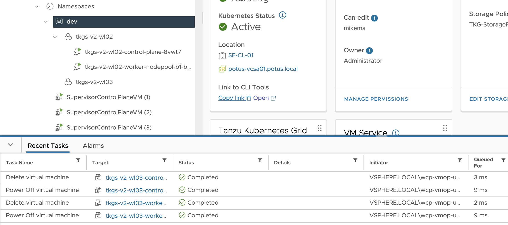

# How to Delete a Tanzu Kubernetes Cluster

Deleting a Tanzu Kubernetes Cluster for Workload Provisioning is shortly described below. 

The Official VMware Documentation can be found here:

https://docs.vmware.com/en/VMware-vSphere/7.0/vmware-vsphere-with-tanzu/GUID-A650DE01-7001-4B3B-804F-652CC73D0171.html

## Table of Contents
1. [Prerequisites](#prerequisites)
1. [Delete a Tanzu Kubernetes Cluster](#delete-a-tanzu-kubernetes-cluster)

## Prerequisites
* [Make sure you are logged in](How-to-Login.md) and connected to the vSphere Namespace where you would like to delete the Tanzu Kubernetes Cluster from. 

## Delete a Tanzu Kubernetes Cluster

Let's start with finding your deployed TKCs in your current vSphere Namespace:

````
kubectl get tanzukubernetescluster

OR

kubectl get tkc

NAME           CONTROL PLANE   WORKER   TKR NAME                           AGE   READY   TKR COMPATIBLE   UPDATES AVAILABLE
tkgs-v2-wl02   1               1        v1.21.2---vmware.1-tkg.1.ee25d55   8d    True    True             [1.21.6+vmware.1-tkg.1.b3d708a]
tkgs-v2-wl03   1               1        v1.21.2---vmware.1-tkg.1.ee25d55   28m   True    True             [1.21.6+vmware.1-tkg.1.b3d708a]
````

In this example we would like to delete 'tkgs-v2-wl03' from the vSphere Namespace:

````
kubectl delete tanzukubernetescluster tkgs-v2-wl03

OR 

kubectl delete tkc tkgs-v2-wl03

tanzukubernetescluster.run.tanzu.vmware.com "tkgs-v2-wl03" deleted
````

You can optionally specify the vSphere Namespace with the '--namespace' option. 

You should see some things moving in your vCenter now as a vSphere Administrator:



You can verify that your cluster is deleted by running the below command again:

````
kubectl get tkc

NAME           CONTROL PLANE   WORKER   TKR NAME                           AGE   READY   TKR COMPATIBLE   UPDATES AVAILABLE
tkgs-v2-wl02   1               1        v1.21.2---vmware.1-tkg.1.ee25d55   8d    True    True             [1.21.6+vmware.1-tkg.1.b3d708a]
````
