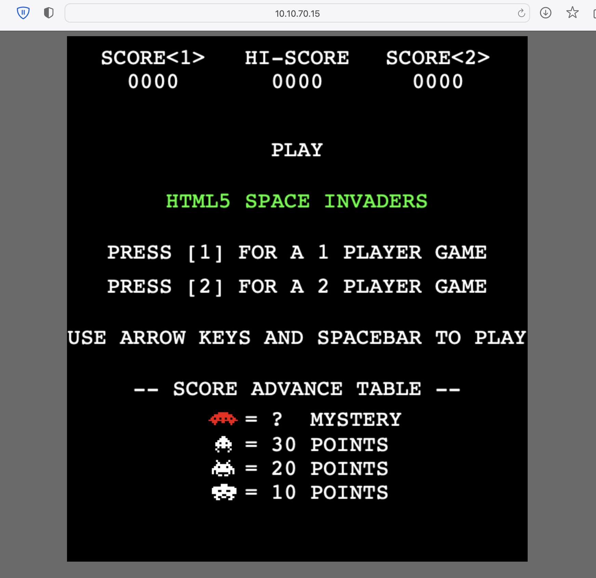
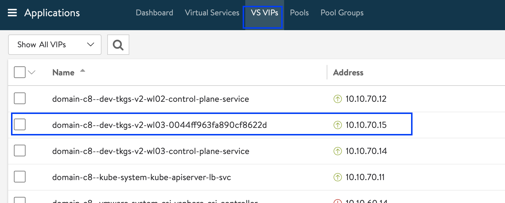
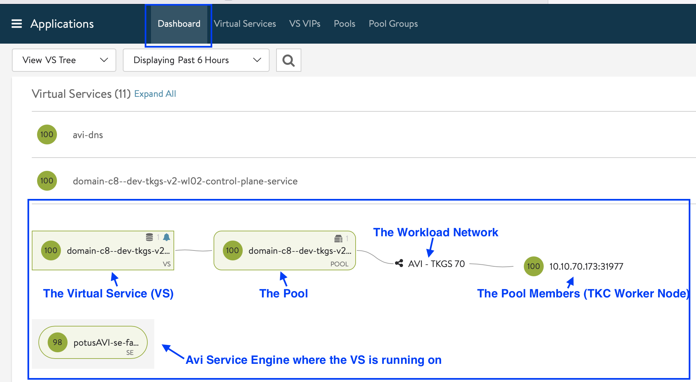
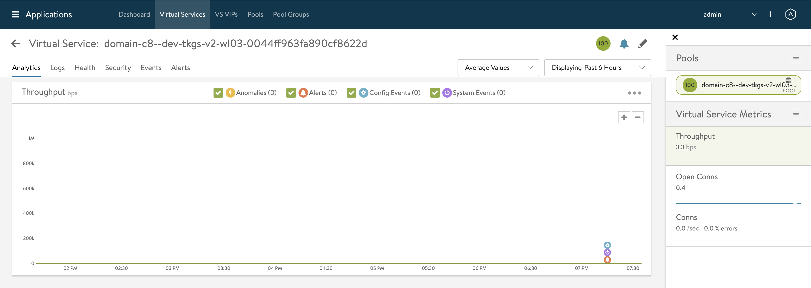
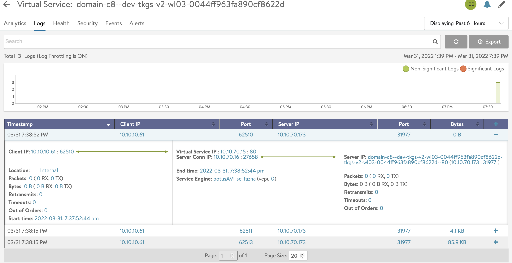

# How to create an L4 Load Balancer with NSX-ALB (Avi)

In this example we will deploy the SpaceInvaders application on a Tanzu Kubernetes Clusters. This application will leverage a L4 Load Balancer from Avi. 

The Application will be deployed in a Pod which exposed Container Port 8080. The L4 LoadBalancer will be exposed on port 80. 

The L4 Load Balancer from Avi is leveraged by the AKO Pod that is running on the Supervisor Control Plane VMs. This AKO Pod listens for L4 Service Requests and translates them to Avi API Calls to the Avi Controller. 

More information regarding Avi & AKO can be found here:
https://avinetworks.com/docs/ako/0.9/avi-kubernetes-operator/

## Table of Contents
1. [Prerequisites](#prerequisites)
1. [Deploy SpaceInvaders](#deploy-spaceinvaders)
1. [Find L4 Load Balancer IP Address via kubectl](#find-l4-load-balancer-ip-address-via-kubectl)
1. [Browse to the SpaceInvaders Website](#browse-to-the-spaceinvaders-website)
1. [Check the L4 Load Balancer in Avi](#check-the-l4-load-balancer-in-avi)
1. [Control in which VIP Network your Load Balancer resides](#control-in-which-vip-network-your-load-balancer-resides)
1. [Limitations](#limitations)


## Prerequisites
* Make sure you have deployed **vSphere with Tanzu with the Avi Integration**
* [Make sure you are logged in](How-to-Login.md) and connected to the Tanzu Kubernetes Cluster in the corresponding vSphere Namespace
* Make sure that you have at least the **Default VMware Permissive Pod Security Policy applied to the Service Accounts** in the Default Namespace. See [How to Apply a Pod Security Policy on a Tanzu Kubernetes Cluster](How-to-Apply-a-Pod-Security-Policy-on-a-Tanzu-Kubernetes-Cluster.md) for more information. 

## Deploy SpaceInvaders

Follow the steps outlined in our example here:
1. [Deploy SpaceInvaders LoadBalancer Example](../../../Example-Applications/kubernetes-example-loadbalancer-spaceinvaders/README.md)

## Find L4 Load Balancer IP Address via kubectl

Once your Space Invaders application is deployed, locate the External IP Address of your Service:

````
kubectl get services 

OR

kubectl get svc

NAME               TYPE           CLUSTER-IP     EXTERNAL-IP   PORT(S)        AGE
spaceinvaders-lb   LoadBalancer   10.103.86.54   10.10.70.15   80:31977/TCP   4m17s
````

In the example above the L4 VIP is '10.10.70.15' and we see that it listens to port 80 and that port is forwarded to 31977 on the node. 

## Browse to the SpaceInvaders Website

1. Open your favourite browser an visit the website 'http://<YOUR-L4-VIP>'. An example is shown below:

````
http://10.10.70.15
````



Feel free to play a game or 2 ;-)

## Check the L4 Load Balancer in Avi

So how does this look in Avi? What exactly happened? Let's find out!

1. Browse to your Avi Controller and Login
1. Make sure you're in the Applications page on your Avi Controller. 
    
1. Under the 'VS VIP' section you can find the Virtual Service corresponding to your VIP that you found in the step '[Find L4 Load Balancer IP Address via kubectl](#find-l4-load-balancer-ip-address-via-kubectl)'. In our example that is '10.10.70.15':
    
1. Now that you know the name of your Virtual Service (Application / L4 Load Balancer) go back to 'Dashboard' and expand your Virtual Service to get a nice brief overview:
    
1. When you click on the Virtual Service you can find more details such as events, alerts & traffic:
    

Go ahead and explore some more! What happens if you enable logging for this Virtual Service? What happens when you generate some traffic? ... 



## Control in which VIP Network your Load Balancer resides

In theory the AKO from Avi can handle Network Selection for External Services by making use of 'AviInfraSettings' CRDs. However the implementation of AKO in vSphere with Tanzu does **not** allow this. 

Why? 
Because the AKO is only running on the Supervisor Control Plane and we cannot create CRDs on the Supervisor, only in our TKC itself. When we deploy AKO in the TKC itself and configure it to handle L4 & L7 we end up with 2 L4 Load Balancers each time you create one. Because the AKO from the Supervisor Control Plane and the AKO from the TKC are both listening for L4 Service Requests. There is currently no way to make the AKO from the Supervisor ignore Service Requests. 

So what is the only option in vSphere with Tanzu? 
* Specify the IP Address of your Load Balancer in the Load Balancer Specification as shown below:
````
vi loadbalancer-ip-spaceinvaders.yaml

apiVersion: v1
kind: Service
metadata:
  name: spaceinvaders-lb-specific-ip
  namespace: default
  labels:
    app: spaceinvaders-lb
spec:
  loadBalancerIP: 10.10.70.75 # Specify the Load Balancer IP Here
  ports:
  - name: http
    port: 80
    protocol: TCP
    targetPort: 8080
  selector:
    app: spaceinvaders
  type: LoadBalancer


kubectl apply -f loadbalancer-ip-spaceinvaders.yaml 
service/spaceinvaders-lb-specific-ip created

kubectl get svc
NAME                           TYPE           CLUSTER-IP       EXTERNAL-IP   PORT(S)          AGE
spaceinvaders-lb-specific-ip   LoadBalancer   10.100.153.122   10.10.70.75   80:30201/TCP     77s
````
* !! Make sure that the IP Address referenced in your L4 Load Balancer Specification is in a VIP Network part of an IPAM Profile on your Cloud Configuration in NSX-ALB (Avi). !!

## Limitations

As mentioned in the section above: **we cannot specify the VIP Network where our L4 Load Balancer should reside in**. This is due to the implementation of AKO in vSphere with Tanzu. 
The **only option** we have is to **define an IP Address** from a specific VIP Network as explained above.

If you would like to have the possibility to select VIP Networks for your L4 Load Balancer in Tanzu, you can look at TKGm (Tanzu Kubernetes Grid multi-cloud). 
