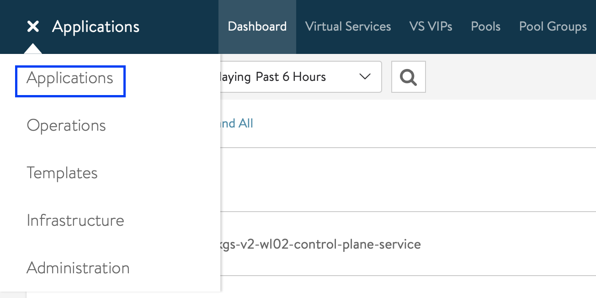
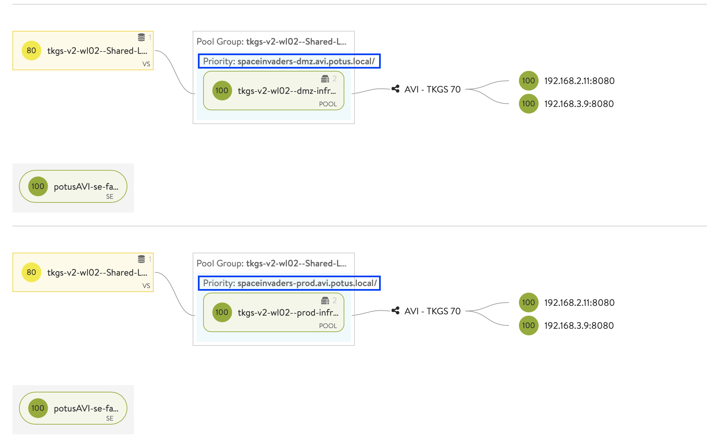
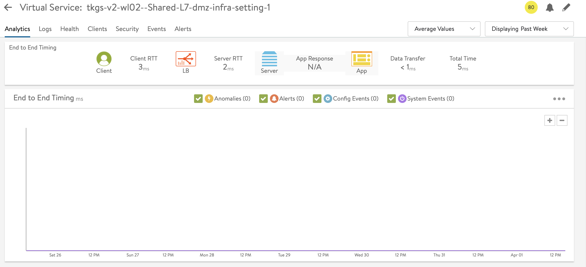

# How to select VIP Network for L7 Ingress Controller with NSX-ALB

In this scenario we are going to deploy 1 Application and present it in multiple VIP Networks. The goal is that the Application has a VIP in the DMZ & Production Network.

We will be using NSX-ALB (Avi) as an L7 Ingress Controller leveraging the IngressClass & AviInfraSettings CRDs. 

## Table of Contents
1. [Prerequisites](#prerequisites)
1. [Deploy Application](#deploy-application)
1. [How does this look in NSX-ALB](#how-does-this-look-in-nsx-alb)
1. [Limitations](#limitations)

## Prerequisites
* Make sure you have deployed **vSphere with Tanzu with the Avi Integration**
* [Make sure you are logged in](How-to-Login.md) and connected to the Tanzu Kubernetes Cluster in the corresponding vSphere Namespace
* Make sure that you have at least the **Default VMware Permissive Pod Security Policy applied to the Service Accounts** in the Default Namespace. See [How to Apply a Pod Security Policy on a Tanzu Kubernetes Cluster](How-to-Apply-a-Pod-Security-Policy-on-a-Tanzu-Kubernetes-Cluster.md) for more information. 
* Make sure that you have [NSX-ALB (Avi) configured as an L7 Ingress Controller via AKO](How-to-use-NSX-ALB-(Avi)-as-an-L7-Ingress-Controller.md).

## Deploy Application

In order to deploy the Application, please make sure to follow the detailed instructions below:
* [Instructions to deploy Application with VIP in multiple Networks](../../../Example-Applications/kubernetes-example-multiple-networks-spaceinvaders/README.md)

## How does this look in NSX-ALB

If all goes well you should now have 2 L7 Ingresses running:
* 1 is running in your PROD Network
* 1 is running in your DMZ Network

They are both delivering the same application. 

Let's dive a bit deeper:

* In NSX-ALB (Avi) you can go to 'Applications' and click on the 'Dashboard'. Here you an find the Application / Virtual Service (VS) that is used to provide your L7 Ingress for our BusyBox Application. 
    

* Expand your L7 Ingress Virtual Services as shown below:
    
* Click on your Virtual Service to find out more such as: logs, analytics and events:
    

Feel free to dive in some more!

## Limitations

The same Limitations exist as described in our other scenario '[How to Use NSX-ALB (Avi) as an L7 Ingres](How-to-use-NSX-ALB-(Avi)-as-an-L7-Ingress-Controller.md#limitations)'. 
