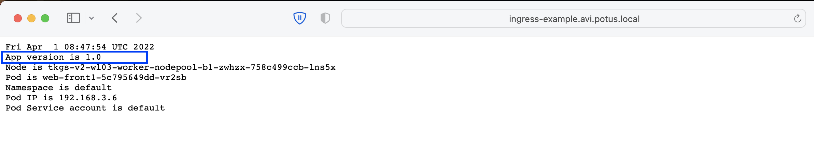
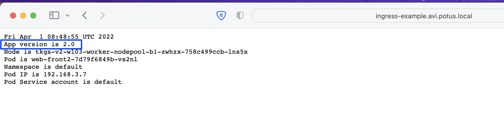
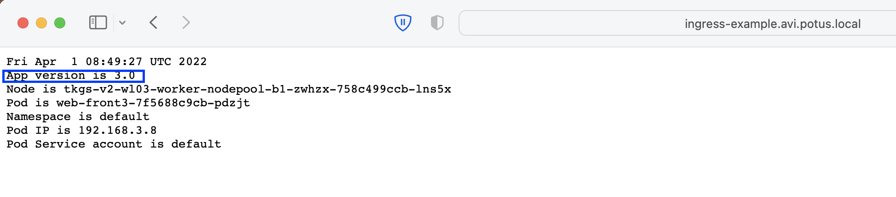
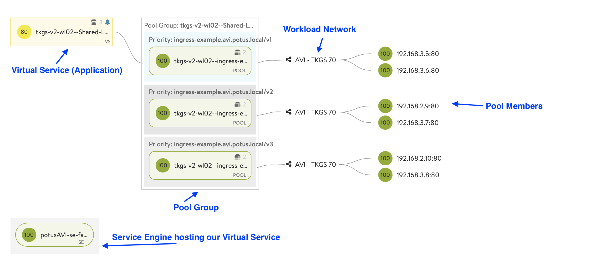
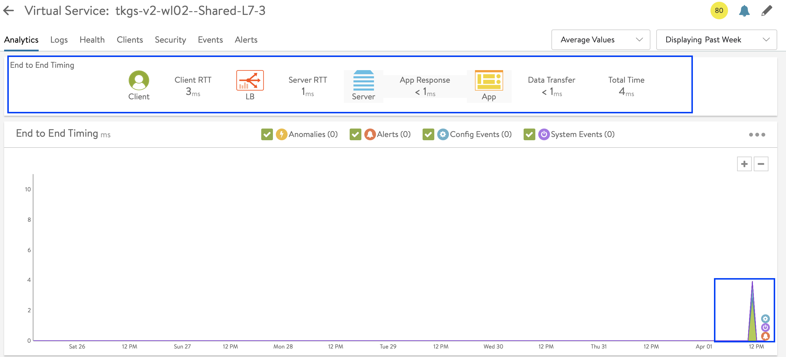

# How to use NSX-ALB (Avi) as an L7 Ingress Controller

This section will explain how we can leverage the NSX-ALB (Avi) in vSphere with Tanzu to deploy L7 Ingress Objects in our Tanzu Kubernetes Clusters (TKC). 

Eventually we will deploy 3 Versions of the same "Application" based on BusyBox. Each Version of the Application is reachable through the L7 Ingress via another Host Path (e.g.: /v1, /v2, /v3). NSX-ALB will facilitate our L7 Ingress. 

## Table of Contents
1. [Prerequisites](#prerequisites)
1. [Configure NSX-ALB for Ingress and Run Test Workload](#configure-nsx-alb-for-ingress-and-run-test-workload)
1. [Verifying the Ingress](#verifying-the-ingress)
1. [How does it look in NSX-ALB](#how-does-it-look-in-nsx-alb)
1. [Limitations](#limitations)

## Prerequisites
* Make sure you have deployed **vSphere with Tanzu with the Avi Integration**
* [Make sure you are logged in](How-to-Login.md) and connected to the Tanzu Kubernetes Cluster in the corresponding vSphere Namespace
* Make sure that you have at least the **Default VMware Permissive Pod Security Policy applied to the Service Accounts** in the Default Namespace. See [How to Apply a Pod Security Policy on a Tanzu Kubernetes Cluster](How-to-Apply-a-Pod-Security-Policy-on-a-Tanzu-Kubernetes-Cluster.md) for more information. 

## Configure NSX-ALB for Ingress and Run Test Workload

In order to use the NSX-ALB (Avi) as an L7 Ingress Controller in vSphere with Tanzu we are going to do the following:
* create avi-system Namespace
* Apply Root Privileges to Service Accounts in the avi-system Namespace
* Deploy AKO in our TKC
* Configuring AKO to only listen for L7 Requests (since the AKO in the Supervisor Control Plane is listening for L4)
* Run a Test Workload (BusyBox) leveraging Ingress in our TKC.

The **instructions** to do all the above can be found [here](https://vra4u.com/2022/02/07/tkgs-use-nsx-alb-avi-as-ingress-controller-for-vsphere-with-tanzu/).

## Verifying the Ingress

If you followed all the instructions from the previous step you should have a 3 BusyBox deployments running; eah providing a "specific version of your application". 

In order to browse to it and test it, you need a DNS Record pointing to your Ingress's VIP. If your NSX-ALB (Avi) is not integrated with your DNS, you need to create the DNS Record manually. 

To find out your VIP, run the following command:
````
kubectl get ingress

NAME      CLASS    HOSTS                             ADDRESS       PORTS   AGE
ingress   avi-lb   ingress-example.avi.potus.local   10.10.60.20   80      5m54s
````

In my example above my Ingress is located on IP '10.10.60.20'. 

Let's create a DNS Record for it; in my case in Windows DNS. 

And browse:
* http://YOUR-INGRESS-URL/v1
    
* http://YOUR-INGRESS-URL/v2
    
* http://YOUR-INGRESS-URL/v3
    

## How does it look in NSX-ALB

* In NSX-ALB (Avi) you can go to 'Applications' and click on the 'Dashboard'. Here you an find the Application / Virtual Service (VS) that is used to provide your L7 Ingress for our BusyBox Application. 
    

* Expand your L7 Ingress Virtual Service as shown below:
    
* Click on your Virtual Service to find out more such as: logs, analytics and events:
    


## Limitations
When doing the step 'Configure NSX-ALB for Ingress and Run Test Workload' we have configured the 'ServiceType' to be 'ClusterIP' in the values.yaml of our AKO Deployment. 

A limitation of ClusterIP is that you can only use **1 Service Engine Group per Tanzu Kubernetes Cluster**. So if you have multiple TKCs, you needd to have multiple Service Engine Groups (1 for each TKC). This impacts your NSX-ALB Licensing heavily. In other words: **you cannot share the same Service Engine Group between TKCs.** 

You can read more about it on the Official VMware Documentation: 
https://docs.vmware.com/en/VMware-Tanzu-Kubernetes-Grid/1.5/vmware-tanzu-kubernetes-grid-15/GUID-mgmt-clusters-install-nsx-adv-lb.html

A solution to this problem would be to change the Service Type to 'NodePortLocal', however this is not supported in vSphere with Tanzu. Officially we are also not capable to change this setting technically (read: the solution does not allow us to change it). 

If you have a requirement to share the same Service Engine Group with multiple Tanzu Kubernetes Clusters for L7 Ingress, you will need to deploy TKGm (Tanzu Kubernetes Grid multi-cloud). 