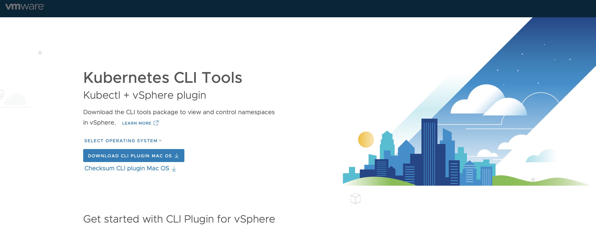

# Install Kubernetes CLI Tools for vSphere

VMware has thoroughly documented this procedure in their Documentation:

https://docs.vmware.com/en/VMware-vSphere/7.0/vmware-vsphere-with-tanzu/GUID-0F6E45C4-3CB1-4562-9370-686668519FCA.html

Basically as a vSphere Administrator you can provide your Developers with a link to the Kubernetes CLI Tools for vSphere. The link will point to the Control Plane Node IP Address. 

Once you have the link to the Kubernetes CLI Tools for vSphere you can use any Web Browser to download them on your system, or use 'wget'. 



Some examples are illustrated below:

## Mac

1. Download the CLI Tools for Mac via your favourite web browser or use 'wget'
    ````
    wget https://<CONTROL-PLANE-IP>//wcp/plugin/darwin-amd64/vsphere-plugin.zip --no-check-certificate
    ````
1. Unzip the downloaded Zip file. 
1. You should have 2 Files 'kubectl' and 'kubectl-vsphere'
1. Copy those 2 files to your Mac's Executeable Search Path (e.g.: /usr/local/bin)
1. Make sure that those files are Executable:
    ````
    chmod +x kubectl
    chmod +x kubectl-vsphere
    ````
1. Verify that it's working:
    ````
    kubectl version --client
    kubectl vsphere login -h
    ````

## Linux

1. Download the CLI Tools for Mac via your favourite web browser or use 'wget'
    ````
    wget https://<CONTROL-PLANE-IP>/wcp/plugin/linux-amd64/vsphere-plugin.zip --no-check-certificate
    ````
1. Unzip the downloaded Zip file. 
1. You should have 2 Files 'kubectl' and 'kubectl-vsphere'
1. Copy those 2 files to your Linux's Executeable Search Path (e.g.: /usr/bin/)
1. Make sure that those files are Executable:
    ````
    chmod +x kubectl
    chmod +x kubectl-vsphere
    ````
1. Verify that it's working:
    ````
    kubectl version --client
    kubectl vsphere login -h
    ````

## Windows

1. Download the CLI Tools for Mac via your favourite web browser. 
1. Unzip the downloaded Zip file. 
1. You should have 2 Files 'kubectl' and 'kubectl-vsphere'
1. Copy those 2 files to your Windows's Executeable Search Path (e.g.: C:\Windows\System32)
1. Verify that it's working:
    ````
    kubectl version --client
    kubectl vsphere login -h
    ````
